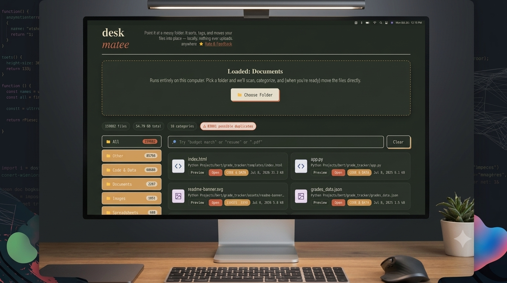

# Deskmatee



Meet Deskmate: your messy files, finally sorted.

Deskmatee is a desktop file organizer built with Tauri v2. It helps you scan a folder, classify files by type and content, tag them intelligently, and move them into a cleaner, more useful folder structure — all locally on your machine.

## Why this project exists

A lot of file clutter is not caused by a lack of storage, but by the absence of a simple system. Deskmatee gives you a fast, private, and approachable way to bring order to folders without uploading files to the cloud or relying on fragile scripts.

## Features

- Scan any folder and inspect files with metadata
- Automatically categorize files into meaningful folders
- Apply smart tags based on filenames and content patterns
- Preview files and open them with the system default app
- Organize files in place with optional dry-run support
- Keep the entire experience local and private
- Optional AI companion for assistance and recommendations

## Tech stack

- Frontend: HTML, CSS, JavaScript
- Desktop runtime: Tauri v2
- Backend: Rust
- File scanning and organization: Rust + Tauri commands

## Project structure

```text
File_Organicer/
├── src/                      # Frontend UI and app logic
│   └── index.html
├── src-tauri/
│   ├── src/
│   │   ├── main.rs           # Entry point
│   │   └── lib.rs            # File scanning, organizing, and Tauri commands
│   ├── capabilities/
│   ├── icons/
│   ├── Cargo.toml
│   └── tauri.conf.json
├── package.json
├── vite.config.js
└── README.md
```

## Prerequisites

### Windows

1. Node.js 18 or newer
2. Rust
3. Visual Studio Build Tools with the Desktop development with C++ workload

### Linux/macOS

You may need the required WebKit and GTK development libraries installed for Tauri.

## Development setup

Install dependencies and start the app in development mode:

```bash
npm install
npm run tauri dev
```

## Build for distribution

Build a Windows installer or portable app:

```bash
npm install
npm run tauri build
```

Artifacts are typically written to:

- src-tauri/target/release/bundle/deskmatee_setup.exe
- src-tauri/target/release/bundle/deskmatee.exe

## How it works

1. Choose a folder through the native file dialog.
2. The Rust backend scans the directory and collects file metadata.
3. The frontend classifies and tags files based on the current rules.
4. The organizer moves files into category folders such as Documents, Images, Archives, or tagged subfolders.

No files leave your machine during the process.

## Customizing rules

You can adjust the classification and tag behavior in the frontend logic inside src/index.html.

The Rust side handles the actual file movement operations; the UI defines the rules for how files are grouped.

## AI companion

Deskmatee includes an optional AI companion for help with organizing ideas, summaries, and recommendations. It uses your chosen provider and API key, so you can enable or disable it based on your preferences.

## Contributing

This project is open source and welcomes collaboration.

If you would like to contribute:

- Fork the repository
- Create a feature branch
- Make your changes
- Open a pull request with a clear summary

## Security

Please review [SECURITY.md](SECURITY.md) before reporting any security concerns.

## License

This project is licensed under the MIT License. See [LICENCE.md](LICENCE.md) for details.
